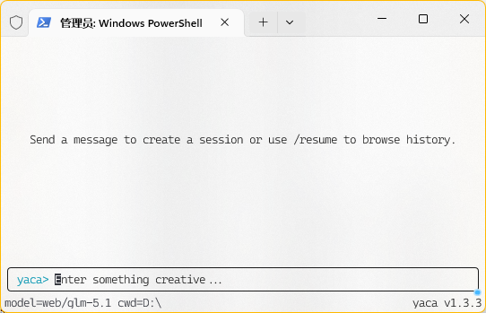
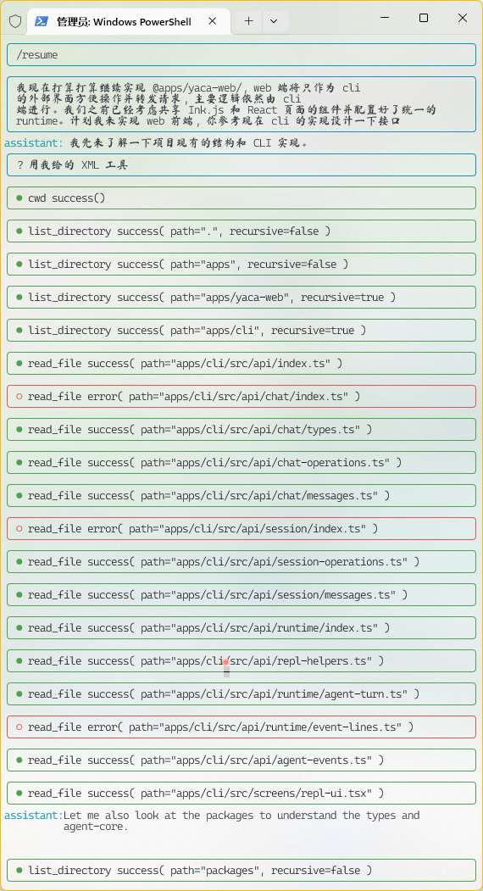

```text
                      ______    ______
                     /      \  /      \
 __    __   ______  |  $$$$$$\|  $$$$$$\
|  \  |  \ |      \ | $$   \$$| $$__| $$
| $$  | $$  \$$$$$$\| $$      | $$    $$
| $$  | $$ /      $$| $$   __ | $$$$$$$$
| $$__/ $$|  $$$$$$$| $$__/  \| $$  | $$
 \$$    $$ \$$    $$ \$$    $$| $$  | $$
 _\$$$$$$$  \$$$$$$$  \$$$$$$  \$$   \$$
|  \__| $$
 \$$    $$
  \$$$$$$
                  yaCA - yet another Coding Agent
```

# yaCA

<p align="center">
    <a href="https://www.npmjs.com/package/@woisol-g/yaca">
        
    </a>
    <a href="https://nodejs.org/">
        =22-green.svg" alt="node version" />
    </a>
    <a href="https://github.com/Woisol/yaCAgent">
        
    </a>
    <a href="https://github.com/Woisol/yaCAgent/stargazers">
        
    </a>
    <a href="https://linux.do" alt="LINUX DO">
        </a>
            </a>
</p>

yaCA 是一个运行在终端里的本地编码 Agent。它使用 OpenAI-compatible `/chat/completions` 接口连接模型，支持文件读写、目录查看、文本搜索、命令执行、会话恢复、工具权限控制，以及兼容不支持原生 function calling 模型的 `tool_call_compatible` 模式。

> 免责声明：本项目主要用于学习、研究与教学实践，本身也是课程作业的一部分；当前实现仅代表开发过程中的阶段性成果，不构成任何形式的产品承诺、商用服务或技术支持保证。使用本项目所产生的风险及因此导致的任何直接或间接损失、责任或第三方权益受损，均由使用者自行承担。


## 快速开始

```bash
pnpm i -g @woisol-g/yaca
# 或者如果你没有安装 pnpm，安装 Node 后使用 npm 安装：
# npm i -g @woisol-g/yaca
yaca
```

首次启动后，可以使用 `/baseurl`、`/model` 和 `/apikey` 命令配置模型和 API 地址，也可以直接编辑 `~/.yaca/config.json`。

主页截图：



## 启动

一次性执行：

```bash
yaca --once "read package.json and summarize this project"
```

指定模型和服务地址：

```bash
yaca --model qwen2.5-vl-7b --baseurl http://127.0.0.1:11434/v1
```

也可以使用环境变量：

```bash
YACA_MODEL=qwen2.5-vl-7b
YACA_BASE_URL=http://127.0.0.1:11434/v1
YACA_API_KEY=your-api-key
```

默认配置会写入：

```text
~/.yaca/config.json
```

可用 `YACA_HOME` 改变配置和会话目录。

## tool_call_compatible：让非原生工具调用模型也能干活

默认情况下，yaCA 会使用 OpenAI-compatible 标准 tools/function calling。如果你的模型或转发服务完整支持 `tools` 字段，这是最直接的模式。

但很多便宜或免费的模型接口并不稳定支持原生 function calling。为此 yaCA 提供了：

```json
{
  "tool_call": {
    "tool_call_compatible": true
  }
}
```

开启后，yaCA 不再依赖 OpenAI tools 字段，而是在系统提示词中要求模型输出 XML 风格的工具调用：

```xml
<tool_call name="read_file">{"path":"package.json"}</tool_call>
```

yaCA 会流式解析这段文本，提取工具名和 JSON 参数，执行工具后把结果继续喂给模型。这样即使模型本身只是普通聊天模型，也能参与文件读取、搜索、编辑和命令执行工作流。

> 流式解析使用了 @woisol-g/sxml.js 库

这个模式很适合搭配 OpenAI-compatible 的聚合、转发或 2api 类服务使用。你可以把 yaCA 指向这些服务提供的 base URL，用低成本甚至免费的可用大模型跑本地编码任务，同时保留工具调用能力。

yaCA 还提供了 `postpone_tool_calls` 和 `try_fallback` 两个选项来提升工具调用的成功率：
- `try_fallback` 会让解析器在模型输出不够规整时尝试兜底解析。对小模型、免费模型、转发模型尤其有用。
- `postpone_tool_calls` 在每次工具调用结束后暂缓数秒，避免频繁请求导致的风险，一般建议设置 5 以上的数值。如果使用正规付费模型不建议设置此项。

使用某免费 glm-5.1 的真实示例：



## 配置示例

完整配置结构：

```json
{
  "model": "qwen2.5-vl-7b",
  "base_url": "http://127.0.0.1:11434/v1",
  "api_key": "sk-your-api-key",
  "max_turns": 20,
  "max_tool_retry": 5,
  "tool_call": {
    "tool_call_compatible": false,
    "postpone_tool_calls": 2,
    "try_fallback": false,
    "allow": {
      "tools": [
        "read_file",
        "list_directory",
        "stat_path",
        "cwd",
        "get_tool_hint"
      ],
      "commands": []
    }
  }
}
```

常用字段：

- `model`：模型名称。
- `base_url`：OpenAI-compatible API 地址，yaCA 会请求 `${base_url}/chat/completions`。
- `api_key`：可选；也可以使用 `YACA_API_KEY`。
- `max_turns`：单次任务中模型和工具循环的最大轮数。
- `max_tool_retry`：连续工具失败上限。
- `tool_call.tool_call_compatible`：开启 XML/SXML 工具调用兼容模式。
- `tool_call.try_fallback`：开启工具调用解析兜底。
- `tool_call.allow.tools`：默认允许执行的工具。
- `tool_call.allow.commands`：允许执行的命令。支持精确匹配和后缀 `*` 前缀匹配，例如 `pnpm *`。

## 工具权限

yaCA 默认只允许一组只读/低风险工具：

```json
["read_file", "list_directory", "stat_path", "cwd", "get_tool_hint"]
```

当模型请求未允许的工具时，界面会在状态栏下方显示 Yes/No。选择 Yes 只允许本次调用，不会自动写入 allow 列表。

管理工具白名单：

```text
/tool
```

信任模式：

```text
Shift + Tab
```

信任模式会允许所有工具调用，状态栏会显示 `[TRUST MODE]`。再次按 `Shift + Tab` 回到默认的不信任模式。

命令执行由 `exec_command` 完成，并且有独立命令白名单：

```json
{
  "tool_call": {
    "allow": {
      "tools": ["exec_command"],
      "commands": ["pnpm *", "node --version"]
    }
  }
}
```

`commands` 支持：

- `"node --version"`：精确匹配。
- `"pnpm *"`：允许所有以 `pnpm ` 开头的命令。
- `"*"`：允许所有命令。

## 内置命令

```text
/help                  Show help
/model <name>          Set the current model
/baseurl <url>         Set the OpenAI-compatible base URL
/apikey <key>          Set the API key
/clear                 Clear context and start a new session
/resume [session-id]   List sessions or resume one by id
/continue              Continue the most recent session
/tool                  Open tool allow-list selector
/exit                  Exit REPL
```

## 快捷键

- `Ctrl+C`：空闲时双击退出；忙碌时中断当前任务。
- `Ctrl+O`：切换工具输出展开/折叠。
- `Shift+Tab`：切换 trust/untrust 模式。
- `Esc`：清空输入；双击打开 rewind。
- `Up/Down`：浏览历史输入。
- `Tab`：路径补全。

## 内置工具

- `read_file`：读取文件。
- `write_file`：写入文件。
- `replace_file`：替换文件内容或行列范围。
- `list_directory`：列目录。
- `search_files`：搜索文本。
- `stat_path`：查看路径状态。
- `move_file`：移动或重命名文件。
- `remove_file`：删除文件或目录。
- `exec_command`：在当前工作目录执行命令。
- `cwd`：返回当前工作目录。
- `get_tool_hint`：返回工具使用提示。

## 会话

yaCA 会按 workspace 保存会话。你可以用 `/resume` 查看历史，用 `/continue` 继续最近一次会话，用 rewind 回到某条用户消息前重新开始。

## 开发

```bash
pnpm install
pnpm run typecheck
pnpm test
pnpm run build
```

---

如果这个项目对你有帮助，不要忘记点个 Star ⭐！