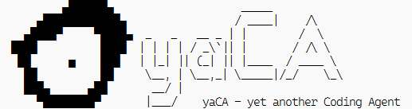

<div align="center">
<!-- <div style="display: flex; flex-direction: column; align-items: center;"> -->
  <!-- <p style="white-space: pre; font-family: 'Courier New'; line-height: 1.3;">
        ▄██████▄                    _____
    ▄████████████▄                 / ____|    /\
  ▄████▀     ▀████▄  _   _   __ _ | |        /  \
████          ████  | | | | / _\`|| |       / /\ \
 ██      ▅    ███   | |_| || (_| || |____  / ____ \
  ██          ██     \__, | \__,_| \_____|/_/    \_\
  ███▄      ▄██       __/ |
    ▀████████▀       |___/    yaCA - yet another Coding Agent
  </p> -->
  
</div>

# yaCA

<p align="center">
    <a href="https://www.npmjs.com/package/@woisol-g/yaca">
        
    </a>
    <a href="https://nodejs.org/">
        =22-green.svg" alt="node version" />
    </a>
    <a href="https://github.com/Woisol/yaCAgent">
        
    </a>
    <a href="https://github.com/Woisol/yaCAgent/stargazers">
        
    </a>
    <a href="https://linux.do" alt="LINUX DO">
        </a>
            </a>
</p>

yaCA 是一个运行在本地的编码 Agent。它连接 OpenAI-compatible `/chat/completions` 接口，提供终端 REPL、一次性任务、可选 Web UI、会话持久化、工具权限控制、文件系统工具、命令执行工具，以及面向非原生 function calling 模型的 XML/SXML 工具调用兼容模式。

> 本项目主要用于学习、研究与教学实践，不构成产品承诺、商业服务或技术支持保证。使用本项目产生的风险由使用者自行承担。

## 快速开始

```bash
pnpm i -g @woisol-g/yaca
# 或者如果你没有安装 pnpm，安装 Node 后使用 npm 安装：
# npm i -g @woisol-g/yaca
yaca
```

如果要使用 Web UI，还需要安装 Web 包：

```bash
pnpm i -g @woisol-g/yaca-web
yaca --serve 3000
```

首次启动后，可以用 `/model`、`/baseurl`、`/apikey` 配置模型，也可以直接编辑 `~/.yaca/config.json`。

```bash
yaca --model qwen2.5-vl-7b --baseurl http://127.0.0.1:11434/v1
yaca --once "read package.json and summarize this project"
yaca --continue
```

环境变量也可覆盖配置：

```bash
YACA_MODEL=qwen2.5-vl-7b
YACA_BASE_URL=http://127.0.0.1:11434/v1
YACA_API_KEY=your-api-key
```

## 核心能力

- OpenAI-compatible 模型客户端，支持普通文本、流式输出、标准 tools/function calling。
- XML/SXML 工具调用兼容模式，用于不稳定或不支持原生 tools 的模型。
- 本地文件工具：读取、写入、替换、搜索、移动、删除、查看路径状态。
- 命令执行工具：通过独立命令 allow-list 控制可执行命令。
- 会话按 workspace 持久化，支持恢复、继续、重命名、软删除和清理。
- 终端 UI 基于 Ink，支持工具确认、rewind、历史输入、路径补全、trust mode。
- Web UI 可选安装，提供侧边栏会话管理、文件拖拽、HTML-first 输出渲染和 iframe 流式预览。

## 内置命令

```text
/help                  Show help
/model <name>          Set the current model
/baseurl <url>         Set the OpenAI-compatible base URL
/apikey <key>          Set the API key
/clear                 Clear context and start a new session
/resume [session-id]   List sessions or resume one by id
/continue              Continue the most recent session
/rename <name>         Rename the current session
/delete                Soft delete the current session
/clean                 Permanently remove soft-deleted sessions
/tool                  Open tool allow-list selector
/exit                  Exit REPL
```

`/delete` 只会从当前 workspace 的 `meta.json` 中移除会话记录，会话目录仍保留在磁盘上。只有 `/clean` 会永久删除不在 `meta.json` 中的会话目录。

## 快捷键

- `Ctrl+C`：空闲时双击退出；运行中中断当前任务。
- `Ctrl+O`：切换工具输出展开/折叠。
- `Shift+Tab`：切换 trust/untrust 模式。
- `Esc`：清空输入；双击打开 rewind。
- `Up/Down`：浏览历史输入。
- `Tab`：路径补全。

## 配置

默认配置位于：

```text
~/.yaca/config.json
```

可以通过 `YACA_HOME` 修改配置和会话根目录。完整结构示例：

```json
{
  "model": "qwen2.5-vl-7b",
  "base_url": "http://127.0.0.1:11434/v1",
  "api_key": "sk-your-api-key",
  "max_turns": 20,
  "max_tool_retry": 5,
  "tool_call": {
    "tool_call_compatible": false,
    "postpone_tool_calls": 2,
    "try_fallback": false,
    "allow": {
      "tools": ["read_file", "list_directory", "stat_path", "cwd", "get_tool_hint"],
      "commands": []
    }
  }
}
```

常用字段：

- `model`：模型名称。
- `base_url`：OpenAI-compatible API 地址，yaCA 会请求 `${base_url}/chat/completions`。
- `api_key`：可选；也可使用 `YACA_API_KEY`。
- `max_turns`：单次任务中模型和工具循环的最大轮数。
- `max_tool_retry`：连续工具失败上限。
- `tool_call.tool_call_compatible`：启用 XML/SXML 工具调用兼容模式。
- `tool_call.postpone_tool_calls`：工具调用后的短暂延迟，用于降低频繁请求风险。
- `tool_call.try_fallback`：模型输出不规整时尝试兜底解析工具调用。
- `tool_call.allow.tools`：默认允许执行的工具。
- `tool_call.allow.commands`：允许执行的命令，支持精确匹配、前缀 `*` 和全局 `"*"`。

## 工具权限

默认只允许一组低风险只读工具：

```json
["read_file", "list_directory", "stat_path", "cwd", "get_tool_hint"]
```

当模型请求未允许的工具时，CLI 会弹出确认。确认只对本次调用有效，不会自动写入 allow-list。可通过 `/tool` 管理工具和命令白名单。

命令执行由 `exec_command` 完成，并有独立命令白名单：

```json
{
  "tool_call": {
    "allow": {
      "tools": ["exec_command"],
      "commands": ["pnpm *", "node --version"]
    }
  }
}
```

## tool_call_compatible

默认情况下，yaCA 使用 OpenAI 标准 tools/function calling。如果模型或中转服务不稳定支持 tools，可以打开兼容模式：

```json
{
  "tool_call": {
    "tool_call_compatible": true
  }
}
```

开启后，yaCA 会要求模型输出 XML 风格工具调用：

```xml
<tool_call name="read_file">{"path":"package.json"}</tool_call>
```

yaCA 会流式解析这段文本，提取工具名和 JSON 参数，执行工具后把结果继续喂给模型。该模式使用 `@woisol-g/sxml.js`，适合搭配 OpenAI-compatible 聚合、中转或轻量模型使用。

## 会话

会话按 workspace 保存到：

```text
${YACA_HOME:-~/.yaca}/sessions/<workspace-hash>/
```

常见操作：

- `/resume`：列出当前 workspace 的会话。
- `/resume <session-id>`：恢复指定会话。
- `/continue` 或 `yaca --continue`：继续最近会话。
- `/rename <name>`：重命名当前会话。
- `/delete`：软删除当前会话。
- `/clean`：永久清理已软删除的会话目录。

## Web UI

Web UI 在独立包 `@woisol-g/yaca-web` 中。安装后可通过 CLI 启动：

```bash
yaca --serve 3000
```

Web UI 提供：

- 原生 history session 路由：`/:sessionId`。
- session 侧边栏创建、选择、重命名和软删除。
- 首条消息自动命名会话。
- Markdown 渲染、代码高亮、文件拖拽输入。
- HTML-first LLM 输出渲染，使用 sandboxed iframe、流式更新、自适应高度和暗色主题。

更多 Web 包细节见 `apps/yaca-web/README.md`，yaca-web 作为 Submodule 开源在另外一个仓库 [Woisol-G/yaCA-Web](https://github.com/Woisol/yaCA-web)

## 开发

```bash
pnpm install
pnpm run typecheck
pnpm test
pnpm run build
```

本地开发命令：

```bash
pnpm dev:cli
pnpm dev:web
pnpm --filter @woisol-g/yaca-web run build
```

## 友链

* Linux Do：https://linux.do

如果这个项目对你有帮助，欢迎点 Star。
