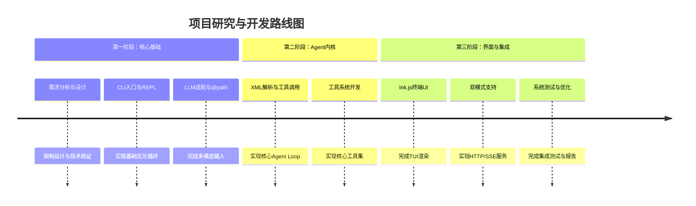

# **基于多模态大模型与终端交互的智能编码Agent系统设计与实现**

## **1. 选题背景与研究意义**

### 1.1 选题背景
随着大语言模型（LLM）技术的飞速发展，AI编程助手已成为提升开发者效率的关键工具。Anthropic 推出的 Claude Code、Cursor等智能体展示了通过自然语言指令进行代码编写、调试和项目管理的强大潜力【turn0search3】【turn0search24】。这些工具的核心在于将大模型与本地开发环境深度集成，实现“思考、规划、执行、反馈”的闭环【turn0search24】。

然而，现有的主流编程助手存在明显局限：
- **交互形式单一**：多数工具仅支持文本输入，无法直接处理UI设计稿、架构图等视觉信息，难以满足“看图写码”等实际需求。
- **工具边界封闭**：功能多被限定在浏览器或IDE插件内，难以无缝融入开发者以终端为核心的日常 workflow。
- **定制与可控性不足**：开源社区对Claude Code等顶级工具的内部架构理解有限，难以进行针对性改造或学术研究【turn0search12】【turn0search27】。

### 1.2 研究意义
本课题旨在设计并实现一个开源的、以终端（CLI）为主体的智能编码Agent，具备以下意义：
- **学术价值**：通过深度解析并复现Claude Code等顶级工具的核心架构（如工具调用流水线、流式交互、上下文管理），为研究AI Agent的基础理论提供实践案例【turn0search12】【turn0search18】【turn0search21】。
- **应用价值**：提供一款支持**多模态输入**（图片+文本）的编码助手，使开发者能直接通过终端处理设计稿、错误截图等视觉上下文，降低认知切换成本。
- **工程价值**：采用 **“CLI即引擎”** 的架构，使系统可被Web客户端、IDE插件等多种前端复用，形成灵活的生态扩展能力【turn0search0】。

## **2. 国内外研究现状综述**

| 方面         | 代表性工作                              | 特点与局限                                                                                                                                |
| :----------- | :-------------------------------------- | :---------------------------------------------------------------------------------------------------------------------------------------- |
| **商业产品** | Claude Code, GitHub Copilot, Cursor     | 功能强大，但**闭源**、**非免费**，架构不透明，难以定制和学术分析【turn0search3】【turn0search12】。                                       |
| **开源框架** | Aider, OpenAI CLI, Claude Code 分析项目 | 部分开源，但多聚焦于单点功能（如代码生成），缺乏对**完整Agent循环**（感知-规划-执行-反馈）的系统性实现【turn0search6】【turn0search15】。 |
| **技术基石** | Ink.js, React for Web                   | **Ink.js** 是用React构建交互式CLI的革命性框架，Claude Code的终端UI即基于此构建【turn0search2】【turn0search11】【turn0search26】。        |
| **核心机制** | Function Calling / Tool Use             | 是AI Agent与外部世界交互的核心，Claude Code通过一套**六层防御流水线**保障其安全性与准确性【turn0search6】【turn0search18】。              |

**研究缺口**：目前缺乏一个**公开、可解析、且支持多模态**的完整Coding Agent参考实现。本项目将填补这一缺口，口，重点实现被Claude Code验证有效的核心技术，于XML的流式工具调用解析、精准的`replace_in_file`编辑策略等【turn0search6】【turn0search12】。

## **3. 研究目标与主要内容**

### 3.1 研究目标
1.  实现一个**基于Node.js的CLI主程序**，集成Qwen2.5-VL多模态大模型，支持通过`@path`语法引用本地图片。
2.  设计并实现一套**自研的Agent执行内核**，核心是基于流式输出的XML工具调用解析协议。
3.  开发一组**核心编码工具**（如`read_file`,, `replace_file`,`exec_command`），并实现工具的注册与调度机制。
4.  构建统一的**用户界面层**，使用Ink.js实现终端TUI，并复用React组件设计，支持未来扩展Web客户端。
5.  系统需支持**双模式运行**：：交互式REPL模式（人机直连）和服务器模式（供客户端连接）【turn0search9】。

## 3.2 主要研究内容
1.  **多模态输入与LLM适配层**：设计`@path`解析模块，将图片转换为base64，并统一适配不同LLM（如Qwen2.5-VL,, Claude）的多模态消息格式。
2. **Agent执行引擎**：实现`Agent Loop`核心循环，完成“用户输入→上下文构建→LLM流式调用→XML解析→工具执行→结果反馈”的全流程管理。
3.  **工具系统**：
    -   定义工具描述（`name`,, `description`,`inputSchema`）。
    -   实现关键工具，特别是实现**精准的`replace_file`**，以最小化对代码库的意外修改【turn0search6】。
    -   设计工具注册表，支持动态加载与执行。
4.  **双模式UI与输出渲染**：
    -   REPL模式：使用Ink.js构建响应式终端UI，包括状态栏、消息流、工具执行详情。
    -   Server模式：通过HTTP/SSE协议，将状态和事件推送给连接的客户端【turn0search9】。
5.  **架构分层**：参考Claude Code的四层架构思想（Tool, Skill, Agent, Plugin），设计清晰分离的模块体系，确保核心逻辑与UI、工具实现解耦【turn0search0】。

## **4. 研究方案与技术路线**

### 4.1 技术栈选型
```mermaid
mindmap
  root((项目技术栈))
    语言与运行时
      TypeScript
      Node.js
    核心引擎
      自研Agent Loop
      流式XML解析器
    大模型层
      Qwen2.5-VL (多模态)
      可插拔Adapter
    终端UI
      Ink.js
      React组件复用
    工具集
      Node.js文件系统API
      Child Process
    客户端扩展
      HTTP/SSE协议
      (未来) Web/Tauri
```

### 4.2 系统总体架构
```mermaid
flowchart LR
    subgraph UI层[UI层: 双模式]
        direction LR
        A[REPL终端<br/>Ink.js] --> B[Server模式<br/>HTTP/SSE]
    end

    subgraph 引擎层[Agent执行引擎]
        C[Agent Loop核心]
        D[上下文管理器]
        E[XML流式解析器]
    end

    subgraph 适配层[LLM与输入适配]
        F[多模态消息构造<br/>@path解析]
        G[LLM Adapter<br/>统一接口]
    end

    subgraph 工具层[工具执行层]
        H[工具注册表]
        I[read_file]
        J[replace_file]
        K[exec_command]
    end

    A & B --> C
    F --> C
    C --> E
    E --> G
    G --> H
    H --> I & J & K
    K --> L[(本地文件系统<br/>Shell环境)]
```

### 4.3 技术路线与进度安排


## **5. 预期目标与创新点**

### 5.1 预期成果
1.  **一个可运行的开源系统**：完整的`Coding Agent` CLI程序，支持图片+文本输入，能完成代码阅读、编写、修改和命令执行等任务。
2.  **一套清晰的架构设计**：：文档化的系统设计，括分层模块、核心接口和交互流程，，可作为类似项目的参考。
3.  **一份开题报告与毕业论文**：细记录研究背景、技术选型、实现难点及解决方案。


### 5.创新点
1.  **多模态终端交互**：在传统文本CLI中无缝集成视觉理解能力，通过`@path`语法将本地图片直接纳入Agent的上下文窗口。
2..  **“CLI即引擎”的架构创新**：CLI设计为独立的核心计算单元，，并通过标准化协议（HTTP/SSE）对外暴露能力，现了前后端的高效解耦。
3.3.  **对顶级工具架构的逆向实践**：分析并实践了Claude Code中的关键设计，如**工具调用的六层防御流水线**【turn0search18】和**精准的文件编辑策略**【turn0search6】，使系统在安全性和实用性上达到接近商业产品的水准。


## **6.重点与难点**

| 类型     | 内容                                                                                | 应对策略                                                                              |
| :------- | :---------------------------------------------------------------------------------- | :------------------------------------------------------------------------------------ |
| **重点** | 1. Agent Loop的稳定性与流式输出控制。<br>2. 工具系统的安全执行与结果准确反馈。。    | 1.采用状态机管理循环状态。<br>2. 参考Claude Code的权限与校验流水线【turn0search18】。 |
| **难点** | 1. **流式解析与渲染的协同**：在LLM流式输出中实时识别XML工具调用块，并同时渲染文本。 | 已有流式XML解析器，需实现buffer与渲染器的协同逻辑【turn0search12】。                  |
|          | 2. **多模态上下文的精准构造**：将用户引用的图片准确转换为LLM所需的视觉消息格式。。  | 内部定义统一中间表示，LLM Adapter负责最终转换【turn0search2】【turn0search5】。】。   |

 **7. 具备的条件与工作基础**

- **技术基础**：开发团队熟练掌握TypeScript、Node.js、React开发，对Ink.js框架有初步实践【turn0search2】【turn0search11】。
- **算法基础**：团队已有一套可工作的**流式XML标签解析算法**，能从LLM的输出流中识别和提取工具调用，这是本项目Agent内核的基石【turn0search1】。
- **资料基础**：已对Claude Code的源码架构进行了深度调研，理解了其工具调用、安全防御、多级上下文管理等核心机制【turn0search12】【turn0search18】【turn0search21】。
- **资源基础**：具备必要的计算资源（可运行Qwen2.5-VL等模型）和开发环境。


## **8.参考文献**

.  Anthropic. Claude Code: Unleash Claude’s raw power directly in your terminal[EB/OL]. (2025-08-29). https://www.anthropic.com/claude-code 【turn0search3】
2..  风***.计算机专业论文开题报告模板[EB/OL].]. 人人文库,024-01-19.9. 【turn0search1】
3.前端之家. ink css,ink - 在线工具[EB/OL]. CSDN博客.. 【turn0search2】
4. yeyulingfeng.. Claude Code 源码解析 – 工具调用管理[EB/OL].(2026-04-02). 【turn0search6】
5.  柚子学长. 如何撰写计算机开题报告？附高质量标准模板及创新点提炼方法[EB/OL].. 搜狐,2025-12-31.. 【turn0search16】
6. 维元码簿. Claude Code 深度拆解：工具系统——运行时流水线与并发调度[EB/OL]. CSDN博客, 2026-04-26. 【turn0search21】
7.  博客园用户. Claude Code 深度拆解:一个顶级AI编程工具的核心架构[EB/OL]. 腾讯新闻, 2025-08-29.. 【turn0search12】
8. 腾讯云开发者社区. Anthropic 终端神器 Claude Code 源码泄露？深度解析 18+ 核心工具架构！[EB/OL]. 【turn0search15】
9.  CSDN用户.. Claude Code 工具调用架构深度解析:六层防御与渐进式加载[EB/OL].技术栈.net, 2026-04-07. 【turn0search18】
10. React + Ink CLI教程[EB/OL]. 掘金, 2022-03-24.. 【turn0search5】
11.Ink——一款使用React风格开发命令行界面应用(CLI App)的nodejs工具[EB/OL]. CSDN博客.. 【turn0search11】
12. 用React 写CLI 是什么体验?— Ink 框架深度解析与实战[EB/OL].. CSDN博客.【turn0search26】
