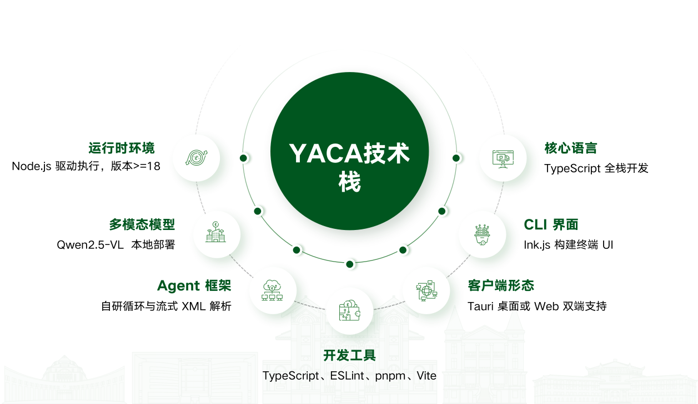
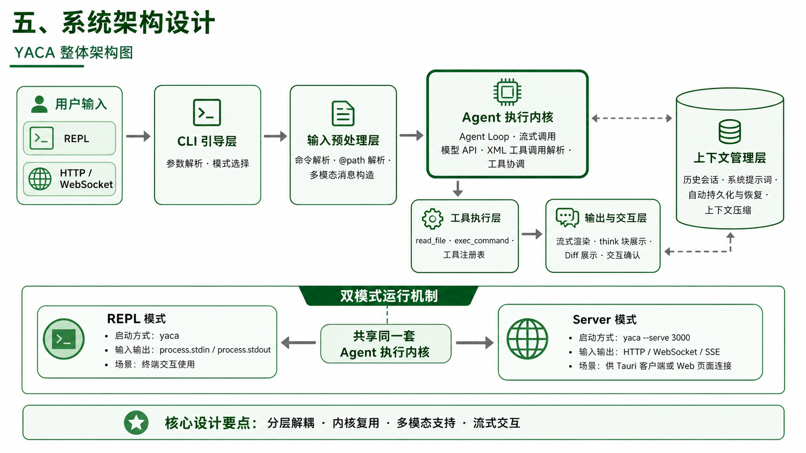
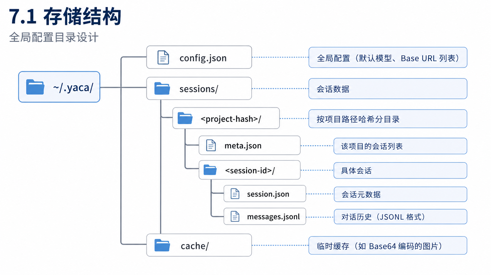
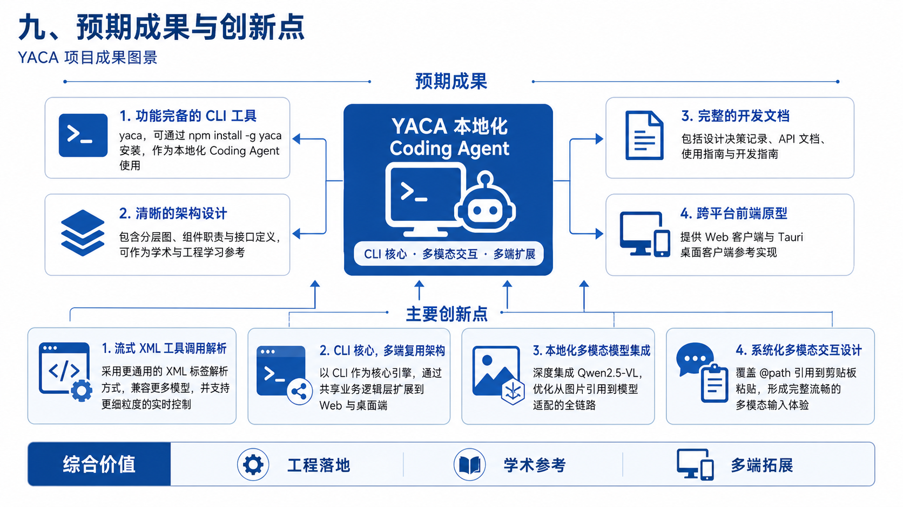

# “yet another Coding Agent” 开题报告

## 项目名称
**yet another Coding Agent (YACA)**

## 一、 项目背景与意义

### 1.1 研究背景
随着大语言模型（LLM）技术的飞速发展，尤其是多模态模型（如 GPT-4V、Claude 3.5、Qwen3.6）的成熟，构建能够理解图像与文本、并能自主调用工具执行复杂软件工程任务的智能体（Agent）已成为研究热点与工程实践前沿。以 Anthropic 的 **Claude Code** 为代表的 Coding Agent 工具，通过将强大的 LLM 能力与终端环境深度集成，实现了直接读写文件、执行命令、搜索代码、管理 Git 等功能，极大地提升了开发者的效率，重新定义了"AI 编程助手"的形态。

然而，现有主流解决方案多基于闭源模型或特定 API，对本地化部署、多模型适配、以及个性化交互体验的支持存在局限。同时，学术界与产业界对具备**多模态理解能力**的 Coding Agent 需求日益增长，尤其是在 UI/UX 设计稿解读、系统架构图理解、实时视频流调试等场景中，纯文本交互已难以满足需求。

### 1.2 项目意义
本项目旨在从零设计并实现一个开源的、跨平台的、支持多模态输入的 Coding Agent 框架——YACA。其意义主要体现在：

1.  **技术探索与验证**：通过自研 Agent Loop 和流式工具调用解析协议，深入探索并实践 LLM Agent 的核心循环机制，验证在纯终端环境下实现流畅、可控的智能体交互的可行性。
2.  **多模态能力集成**：以开源的 Qwen3.6 模型为核心，系统性地构建多模态输入处理链路，解决从本地图片引用（`@path`）、格式转换到模型消息适配的全流程问题，为同类项目提供参考。
3.  **架构创新与模块化**：采用"CLI 为核，客户端/Web 为辅"的架构，并通过共享业务逻辑层实现跨平台复用，为未来扩展桌面（Tauri）和 Web 客户端奠定基础，降低二次开发成本。
4.  **提供可定制的解决方案**：支持多模型切换、Base URL 配置等，使开发者能够根据自身资源和任务需求，灵活选择本地或远程的 LLM 服务，并方便地接入其他兼容 OpenAI 工具调用协议的模型。

## 二、 国内外研究现状

### 2.1 多模态大模型发展
当前，多模态大语言模型（MLLM）正从单纯的图文理解向复杂的视觉推理和智能体操作演进。阿里云开源的 **Qwen3.6** 系列（3B/7B/72B）是其中的佼佼者，其旗舰版本在 13 项权威评测中得分领先，并原生支持工具调用（Tool Calling），这使得模型能够分析图像内容后自主选择外部工具执行任务，是构建视觉智能体的核心技术。其核心架构采用视觉编码器（CLIP-ViT）与多模态融合投影层，将视觉 token 与文本 token 拼接后输入 LLM 解码器，实现了端到端的对齐训练。

### 2.2 Coding Agent与交互界面
**Claude Code** 是当前最成功的 Coding Agent 之一，其核心是一个基于 React 和 Ink 框架构建的复杂终端 UI（REPL.tsx），它管理着消息流、API 调用、工具权限和 60 余种对话框的优先级。Ink 框架作为"React for CLIs"，通过将 React 的虚拟 DOM 渲染为终端输出的字符串，并集成 Yoga 布局引擎实现 Flexbox 布局，彻底改变了 CLI 应用的开发体验，被 GitHub Copilot CLI、Shopify CLI 等众多项目采用。Claude Code 的成功展示了**组件化、声明式 UI** 在终端环境中的巨大潜力。

同样值得关注的是 **Codex CLI**，这是一个基于 OpenAI Codex 模型开发的命令行智能体工具。Codex CLI 采用轻量级的设计理念，通过精简的命令接口直接与用户交互，主要聚焦于代码生成、自然语言指令转换为命令行操作的核心功能。其架构特点是**轻量、高效、快速启动**，在资源消耗上相比 Claude Code 的复杂 UI 系统更经济。Codex CLI 通过简洁的流式输出和即时反馈，为开发者提供了**快速迭代**的体验。然而，由于其较为简化的交互设计，Codex CLI 在**多步骤任务协调** 和 **会话上下文管理** 方面的能力相对有限，且对本地模型的支持不足，主要依赖于闭源的 OpenAI API 服务。


### 2.3 存在的不足与本项目切入点
尽管现有方案强大，但本项目旨在从不同角度切入：
1.  **侧重开源生态**：选择开源的 Qwen3.6 模型，隐私和风险可控。
2.  **强调架构的清晰与可复用**：明确分层（输入、Agent 内核、工具、输出），并设计跨平台共享层，便于学习和二次开发。
3.  **探索更精细的多模态交互**：设计 `@path` 引用机制，并支持在 REPL 中直接粘贴图片（`Ctrl+V`），优化多模态输入体验。

## 三、 项目目标与核心定位

### 3.1 核心定位
YACA 的核心是一个**以 CLI 为主程序的、功能完备的 Coding Agent 执行引擎**。客户端（Tauri 桌面应用或 Web 页面）作为可选的附属界面，通过调用 CLI 的 Server 模式（`--serve`）实现功能。

### 3.2 项目边界
- **支持**：多模态输入（文本 + 图片）；基础 Coding Agent 功能（文件读写、命令执行、目录搜索）；流式输出与工具调用可视化；对话历史持久化与恢复。
- **暂不重点支持**：复杂的 Git 工作流；MCP 服务器集成；项目级技能（Skills）系统；权限的精细化配置（初期采用确认式提示）。

## 四、 技术选型与可行性分析

### 4.1 技术栈全景图



<!-- ```mermaid
mindmap
  root((YACA 技术栈))
    核心语言
      TypeScript 全栈
    运行时环境
      Node.js (>= 18)
    多模态模型
      Qwen3.6 (主模型)
    Agent 框架
      自研 Agent Loop
      流式 XML 工具解析 (@woisol-g/sxml.js)
    CLI 界面
      Ink.js (React for CLI)
      REPL 交互模式
    客户端 (选)
      Tauri (桌面)
      Web (--serve 模式)
    开发工具
      pnpm、Vite
      TypeScript、ESLint
``` -->

### 4.2 关键选型决策与依据

| 组件             | 选型                  | 选型依据与说明                                                                            |
| :--------------- | :-------------------- | :---------------------------------------------------------------------------------------- |
| **多模态模型**   | **Qwen3.6**           | 开源、性能优异（尤其在文档理解上）、原生支持工具调用。通过 API 进行接入以简化运维与集成。 |
| **模型部署**     | **Qwen3.6**           | 通过 Qwen3.6 API 进行统一接入与管理，简化运维与集成，不采用本地部署策略。                 |
| **CLI 框架**     | **Ink.js**            | 基于 React，组件化开发、Flexbox 布局、交互丰富，已被 Claude Code 等大型项目验证。         |
| **工具调用解析** | **自研流式 XML 解析** | 从零实现一个解析模型输出的 XML 格式工具调用，实现低延迟的实时解析与执行。                 |
| **客户端技术**   | **Tauri**             | 使用 Web 技术开发，性能高、包体小、跨平台，适合未来开发桌面客户端。                       |

**可行性结论**：所选技术栈均为成熟的开源方案，社区活跃，文档齐全。TypeScript 全栈保证了类型安全和开发效率，结合 Ink.js 强大的渲染能力，构建一个功能完善的 Coding Agent 在技术上是完全可行的。

## 五、 系统架构设计

### 5.1 整体架构分层
系统采用清晰的分层架构，各层职责明确，通过定义良好的接口进行通信。



**各层说明**：
- **CLI 引导层**：处理命令行参数，选择启动 REPL 模式或 Server 模式。
- **输入预处理层**：解析用户输入中的 `@path` 图片引用、内置命令（如 `/model`），并构造符合 Qwen3.6 要求的多模态消息对象。
- **Agent 执行内核**：这是系统的大脑，实现**自研的 Agent Loop**。它负责：1) 将对话历史、系统提示词组装为请求；2) 以流式方式调用模型 API；3) **实时解析模型输出流中的 XML 格式的工具调用指令**；4) 协调工具的执行和结果的反馬。
- **工具执行层**：包含所有定义好的工具（如 `read_file`、`exec_command`），通过注册表自描述，由 Agent 内核无硬编码逻辑地调用。
- **输出与交互层**：使用 Ink.js 将 Agent 内核的输出（文本流、think 块、工具调用状态）流式渲染到终端界面，并提供交互式确认界面（如工具执行前确认）。
- **上下文管理层**：管理对话历史，实现自动持久化和恢复，并负责长对话下的上下文压缩策略。


### 5.2 双模式运行机制
| 模式            | 启动方式            | 输入输出通道                       | 适用场景                       |
| :-------------- | :------------------ | :--------------------------------- | :----------------------------- |
| **REPL 模式**   | `yaca`              | `process.stdin` / `process.stdout` | 开发者直接在终端互动使用       |
| **Server 模式** | `yaca --serve 3000` | HTTP/WebSocket / SSE/WebSocket     | 供 Tauri 客户端或 Web 页面连接 |

**关键设计**：两种模式**共享同一套 Agent 执行内核**。REPL 模式通过 Ink.js 的 `useInput` Hook 捕获键盘事件，而 Server 模式通过 WebSocket 接收客户端消息，两者最终都会转化为标准的消息格式送入 Agent 内核处理。这保证了核心逻辑的一致性和复用性。

## 六、 核心功能设计

### 6.1 多模态输入实现
1.  **`@path` 引用机制**：用户在输入中可以使用 `@path/to/image.png` 引用本地图片。
    - **解析逻辑**：正则匹配 `@path`，尝试解析为绝对/相对路径。
    - **处理流程**：成功读取文件后，转换为 Base64 编码，符合 Qwen3.6 要求的 `{"type": "image_url", "image_url": {"url": "data:image/jpeg;base64,..."}}` 格式消息。失败则保留为文本。
    - **支持格式**：.jpg、.png、.webp 等常见图片格式。
2.  **剪贴板粘贴支持**：监听 `Ctrl+V` 事件，尝试从剪贴板获取图片，并自动插入为 `@temp_clipboard_image.png` 引用，临时保存到缓存目录。

### 6.2 工具集与工具注册表
第一版工具集聚焦于开发者最常用的能力：

 | 工具名           | 功能               | 关键参数                                                                               |
 | ---------------- | ------------------ | -------------------------------------------------------------------------------------- |
 | `get_tool_hint`  | 获取工具使用格式   | `toolName?`                                                                            |
 | `read_file`      | 读取文件内容       | `path`, `startLineNumber?`, `startColumn?`, `endLineNumber?`, `endColumn?`             |
 | `write_file`     | 创建或完全覆写文件 | `path`, `content`, `append?`, `encoding?`, `dangerouslyOverride?`                      |
 | `replace_file`   | 精准替换文件内容   | `path`, `new_text`, `startLineNumber?`, `startColumn?`, `endLineNumber?`, `endColumn?` |
 | `list_directory` | 列出目录结构       | `path`, `recursive?`                                                                   |
 | `search_files`   | 全文搜索           | `pattern`, `path?`, `include?`                                                         |
 | `exec_command`   | 执行 Shell 命令    | `command`, `timeout?`, `cwd?`                                                          |

**核心设计**：所有工具通过一个**工具注册表**进行管理。每个工具在注册时需提供：名称、描述、参数格式、执行函数。Agent 内核通过注册表查询工具描述，动态生成系统提示词，在解析到工具调用时通过名称查找并执行相应函数，实现了解耦。

### 6.3 交互式 UI/UX 设计
界面采用**两列布局**：
- **上方主区域**：显示对话消息流和可折叠的工具执行详情。
- **底部**：输入栏和状态栏（显示当前模型、工作目录、执行时间等）。

**关键交互流程**：
1.  **流式渲染**：消息和"think"块直接流式输出。
2.  **工具调用可视化**：当解析到 `tool_call` XML 标签时，立即在界面中创建一个"工具调用卡片"，显示工具名和参数。工具执行完成后，在卡片中显示结果（成功/失败/输出）。
3.  **快捷键系统**：设计了一套完整的快捷键（如 `Ctrl+C` 复制/中断、`Esc` 取消输入、`Ctrl+V` 粘贴），提升操作效率。

## 七、 数据持久化与会话管理


### 7.1 存储结构
参考 Claude Code 的 `~/.claude` 目录模式，设计 `~/.yaca/` 全局配置目录。



### 7.2 会话管理流程
- **启动**：首次进入时，用户创建新会话或恢复历史会话（通过 `/resume` 命令）。
- **保存**：用户输入消息后，自动将新的消息追加到对应的 `messages.jsonl` 文件，并更新 `session.json` 中的时间戳和消息计数。
- **恢复**：通过 `/resume` 命令，以交互式浏览器形式列出历史会话供用户选择，加载其消息历史。


### 7.3 性能优化策略
- **懒加载**：启动时只加载最近 N 条消息到内存，其余按需读取。
- **缓存机制**：`@path` 引用的图片转 Base64 后缓存在 `cache/` 目录，避免重复读取和编码。
- **并发安全**：对会话文件的读写使用文件锁机制，确保数据完整性。

## 八、 项目实施计划

| 阶段                              | 时间     | 核心任务                                                                                                                                                                                                                                   | 交付物                                         |
| :-------------------------------- | :------- | :----------------------------------------------------------------------------------------------------------------------------------------------------------------------------------------------------------------------------------------- | :--------------------------------------------- |
| **第一阶段：框架搭建**            | 第1-2周  | 1. 初始化 TypeScript 项目，完成基础目录结构、构建脚本和依赖配置。2. 实现最小可用的 Ink.js REPL 界面，完成文本输入、消息输出和中断控制。3. 接通 Qwen3.6 API 的基础对话接口（含 API key 与 Base URL 验证），先验证纯文本请求链路与认证流程。 | 可进行纯文本对话的 CLI 原型（API 接入）。      |
| **第二阶段：核心 Agent 能力实现** | 第3-4周  | 1. 实现 Agent Loop 的主流程和流式 XML 工具调用解析。2. 完成工具注册表，并落地 `read_file`、`write_file`、`exec_command` 等最小工具集。3. 加入 `@path` 图片引用解析与 Base64 转换，验证多模态请求能正常发出。                               | 具备基础多模态输入和工具调用能力的可演示版本。 |
| **第三阶段：完善与交互优化**      | 第5-6周  | 1. 优化终端界面布局，补充工具调用状态展示和错误提示。2. 实现 `/model`、`/clear` 等基础内置命令。3. 补齐快捷键和输入体验。4. 提供 Server 模式的基础能力，先支持单客户端连接和消息收发。                                                     | 可在终端稳定使用的 CLI 客户端。                |
| **第四阶段：数据持久化与优化**    | 第7-8周  | 1. 实现会话保存、恢复和历史列表展示。2. 增加图片缓存与基础性能优化。3. 补充单元测试和关键流程的集成测试，修复核心问题。                                                                                                                    | 能保存会话并支撑日常使用的稳定版本。           |
| **第五阶段：客户端扩展与发布**    | 第9-10周 | 1. 基于 Vite 实现 Web 客户端的最小闭环，验证与 `--serve` 模式联通。2. 如时间允许，再补充 Tauri 桌面端原型。3. 完成使用文档、开发说明和发布前检查。                                                                                         | 可展示的 Web 版原型及发布前版本。              |

## 九、 预期成果与创新点

### 9.1 预期成果
1. **一个功能完备的 CLI 工具**：`yaca`，可通过 `npm install -g yaca` 安装，作为本地化的 Coding Agent 使用。
2.  **一套清晰的架构设计**：包含分层图、组件职责和接口定义，可作为学术和工程学习的参考。
3. **一套完整的开发文档**：包括设计决策记录、API 文档、使用指南和开发指南。
4.  **一个跨平台的前端原型**：Web 客户端和 Tauri 桌面客户端的参考实现。


### 9.2 主要创新点
1. **自研流式 XML 工具调用解析**：与依赖模型特定输出格式的方案不同，我们采用更通用的 XML 标签解析方式，理论上可兼容更多模型，并实现更细粒度的实时控制。
2.  **CLI-核心，多端复用的架构**：明确了 CLI 作为核心引擎的地位，通过共享业务逻辑层实现了到 Web 和桌面端的扩展，这在同类开源项目中较为少见。
3. **集成云端多模态模型**：通过 Qwen3.6 API 深度集成，并优化了从图片引用到模型适配的全链路，提供可复用的实践方案。
4.  **系统化的多模态交互设计**：从 `@path` 引用到剪贴板粘贴，设计了一套完整、流畅的多模态输入交互体验。



## 十、 可能面临的风险与挑战

1.  **模型能力与稳定性**：采用 Qwen3.6 API 会带来对网络可用性、延迟和费用的依赖；相较之下，本地小模型在复杂推理上或有差距，但本项目不采用本地部署策略。**对策**：设计好降级和重试机制、请求缓存与超时策略，并预留切换到备用云端模型或降级策略。
2.  **流式解析的复杂度**：在终端中实时、准确地解析模型输出的流式 XML 并保持界面流畅具有挑战性。**对策**：借鉴 Claude Code 的解析策略，并充分测试流式 XML 解析的实现效果。
3.  **终端渲染性能**：复杂的 Ink.js 界面在大量消息和工具调用时可能出现渲染卡顿。**对策**：采用虚拟列表、`Static` 组件等性能优化策略。
4.  **工具执行的安全风险**：Agent 执行任意命令可能带来安全风险。**对策**：初期对 `exec_command` 等高风险工具执行前进行确认提示，并明确告知用户风险。


## 十一、 结论

"yet another Coding Agent (YACA)" 项目立足于前沿的 LLM Agent 和多模态技术，旨在通过自研架构和精心设计，实现一个开源、基于云端 API、支持多模态输入的高效编程助手。项目不仅关注功能实现，更注重架构的清晰性、可扩展性和用户体验的流畅性。通过本项目的实施，期望能够产出具有实践价值的开源成果，并为相关领域的技术研究与应用开发提供有益的参考和借鉴。