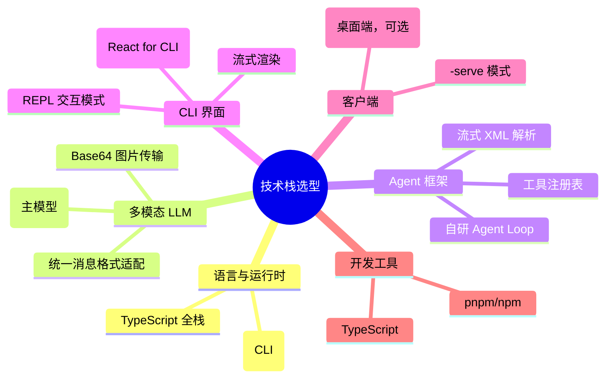
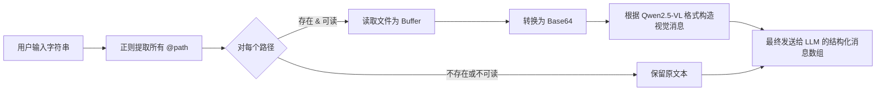

好的，我将把我们关于 Coding Agent 项目的所有技术决策和设计讨论，整理成一份结构化的决策文档，以便于后续开发参考。

## 📋 项目决策总结：多模态 Coding Agent

### 1. 核心定位与边界
| 决策点         | 最终决策                                 | 说明                                                          |
| -------------- | ---------------------------------------- | ------------------------------------------------------------- |
| **项目核心**   | CLI 为主程序，客户端/Web 为附属          | CLI 即核心引擎【turn0search4】【turn0search8】                |
| **多模态范围** | 图片 + 文本                              | 支持通过 `@path` 引用本地图片【turn0search3】【turn0search6】 |
| **Agent 架构** | 自研 Agent 循环                          | 基于现有的流式 XML 工具调用解析协议                           |
| **目标平台**   | 跨平台（Node.js CLI + Tauri 客户端/Web） | CLI 优先，客户端可选                                          |

---

### 2. 技术栈选型


---

### 3.3. 架构设计决策

## 3.1 整体架构分层
```mermaid
flowchart TD
    A[用户输入<br/>REPL / HTTP] --> B[CLI 引导层<br/>参数解析 & 模式选择]
    B --> C[输入预处理层<br/>@path 解析 & 多模态构造]
    C --> D[Agent 执行内核<br/>循环 & XML 解析]
    D --> E[工具执行层<br/>文件操作 & 命令执行]
    E --> F[输出与交互层<br/>流式渲染 & Diff 展示]
    D -.-> G[(上下文管理<br/>历史 & 系统提示词)]
    F -.-> G
```

#### 3.2 双模式运行
| 模式            | 启动方式                | 输入来源        | 输出方式         | 适用场景                                             |
| --------------- | ----------------------- | --------------- | ---------------- | ---------------------------------------------------- |
| **REPL 模式**   | `my-agent`              | `process.stdin` | `process.stdout` | 开发者直接使用                                       |
| **Server 模式** | `my-agent --serve 3000` | HTTP/WebSocket  | SSE/WebSocket    | Tauri/Web 客户端连接【turn0search2】【turn0search5】 |

> **关键设计**：两种模式共享同一套 Agent 执行内核，仅输入输出通道不同【turn0search4】。

---

### 4. 多模态��入实现

### 4.1 `@path` 语法规范
| 支持                              | 不支持（后续迭代） |
| --------------------------------- | ------------------ |
| 绝对路径和相对路径                | URL 引用           |
| 常见图片格式（.jpg, .png, .webp） | 目录展开           |
| 单个/多个 `@path` 引用            | 视频文件           |
| 读取失败则保留为纯文本            | —                  |


#### 4. 解析与转换流程



#### 4. Qwen2.5-VL 消息适配
基于搜索结果，，Qwen2.-VL 的多模态输入格式【turn0search6】【turn0search9】：

| 特性            | 格式                                                                          | 说明         |
| --------------- | ----------------------------------------------------------------------------- | ------------ |
| **Base64 图片** | `{"type": "image_url", "image_url": {"url": "data:image/jpeg;base64,4,..."}}` | 主要使用方式 |
| **URL 图片**    | `{"type": "image_url",image_url": {"url": "https://..."}}`                    | 可选支持     |
| **文本消息**    | `{"type": "text", "text": "..."}`                                             | 标准文本     |

> **实现建议**：内部统一使用 Claude 的 `source.type=base64` 格式作为中间表示，再转换为 Qwen 格式【turn0search11】。

---

### 5.. 工具集规划（第一版）

 | 工具名             | 功能                 | 关键参数                       | 优先级 |
 | ------------------ | -------------------- | ------------------------------ | ------ |
 | `read_file`        | 读取文件内容         | `path`, `offset?`, `limit?`    | P0     |
 | `write_file`       | 创建或完全覆写文件   | `path`, `content`              | P0     |
 | **`replace_file`** | **精准替换**文件内容 | `path`, `old_text`, `new_text` | **P0** |
 | `list_directory`   | 列出目录结构         | `path`, `recursive?`           | P0     |
 | `search_files`     | 全文搜索             | `pattern`, `path?`, `include?` | P1     |
 | `exec_command`     | 执行 Shell 命令      | `command`, `timeout?`, `cwd?`  | P0     |

> **核心设计**：工具通过注册表自描述，Agent 循环无硬编码逻辑【turn0search10】。

---

### 6. UI/UX 设计决策

#### 6.1 整体布局结构
```mermaid
flowchart TD
    A[整体布局] --> B[顶部状态栏]
    A --> C[主内容区]
    A --> D[底部输入栏]

    B --> B1[模型标识]
    B --> B2[工作目录]
    B --> B3[工具执行状态]

    C --> C1[对话消息流]
    C --> C2[工具执行详情<br/>可折叠/展开]

    D --> D1[多行输入区]
    D --> D2[@path 引用支持]
    D --> D3[快捷键提示]
```

#### 6.2 Ink.js 与 React Web 共享策略
| 层次           | 职责                     | 示例                               |
| -------------- | ------------------------ | ---------------------------------- |
| **共享层**     | 布局、状态管理、业务逻辑 | `MainLayout`, `useAgentLoop`       |
| **平台适配层** | 平台特定渲染             | `InkDiffPreview`, `WebDiffPreview` |

> **设计原则**：逻辑在共享层，渲染在平台层【turn0search2】【turn0search5】。

#### 6.3 关键交互流程
1. **工具调用流式渲染**：
   - 文本 token → 直接渲染
   - 开始标签 → 创建工具调用块
   - 参数 token → 流式显示
   - 结束标签 → 执行并显示结果

2. **状态指示**：
   - `● 思考中...` (LLM 调用)
   - `⚡ 执行: tool_name` (工具执行)
   - `✓ 完成: 3个文件已修改` (结果)

---

### 7. 项目结构建议
```
coding-agent/
├── package.json
├── tsconfig.json
├── bin/
│   └── cli.ts              # 入口
├── src/
│   ├── agent/
│   │   ├── loop.ts         # Agent 主循环
│   │   ├── context.ts      # 上下文管理
│   │   └── xml-parser.ts   # XML 解析（已有）
│   ├── tools/
│   │   ├── registry.ts     # 工具注册表
│   │   ├── read-file.ts
│   │   ├── write-file.ts
│   │   ├── replace-file.ts
│   │   └── types.ts
│   ├── llm/
│   │   ├── adapter.ts      # 统一 LLM 接口
│   │   ├── qwen-vl.ts      # Qwen2.5-VL 适配器
│   │   └── message-builder.ts
│   ├── input/
│   │   └── at-path-parser.ts
│   ├── ui/
│   │   ├── shared/         # 共享组件
│   │   ├── ink/            # Ink.js 平台适配
│   │   └── web/            # React Web 平台适配
│   └── server/
│       └── index.ts        # --serve 模式
├── tauri-app/              # 可选
└── tests/
```

---

### 8. 实现优先级与里程碑
```mermaid
gantt
    title 开发路线图
    dateFormat  YYYY-MM-DD
    axisFormat  %m-%d

    section 第一阶段
    CLI I 骨架 + REPL 模式     :a1,026-05-04, 4d
    Agent 循环 + XML 解析    :a2,2, after a1,d
    @path 图片解析           :a3, after a1, 2d

    section 第二阶段
    基础工具实现 (P0)        :a4, after a2, 5d
    Ink.js UI 基础布局       :a5, after a2,2, 3d
    流式输出 + 工具渲染      :a6,fter a5, 4d

    section 第三阶段
    Server 模式实现          :a7, after a4, 3d
    Web 前端适配             :a8, after a7,7, 4d
    Diff 预览组件            :a9,fter a6, 3d

    section 第四阶段
    Tauri 客户端集成         :a10, after a8, 5d
    错误处理与优化           :a11, after a10, 3d
```

---


### 9. 待讨论/后续迭代
1. **上下文管理策略**（长对话、大型项目）
2.. **权限与安全机制**（工具执行确认）
3.*主题系统**（明暗主题切换）
4.. **性能优化**（图片压缩、大文件处理）
5. **多用户支持**（Server 模式）

--

### 10. 参考资源
- **Qwen2.5-VL 文档**：阿里云多模态模型指南【turn0search6】【turn0search9】
- **Ink.js 最佳实践**：*：React for CLI【turn0search5】【turn0search8】
- **Claude Code UI 参考**：端界面设计模式【turn0search4】【turn0search7】
- **多模态输入实现**：：vLLM 多模态处理【turn0search0】【turn0search3】

--

这份决策文档涵盖了项目的所有关键决策和设计细节。可以基于此开始具体的代码实现，实现，有任何调整或深入讨论的需求，提出！