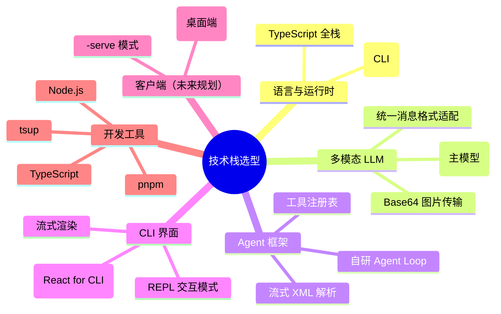
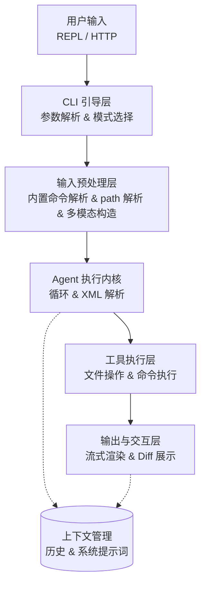
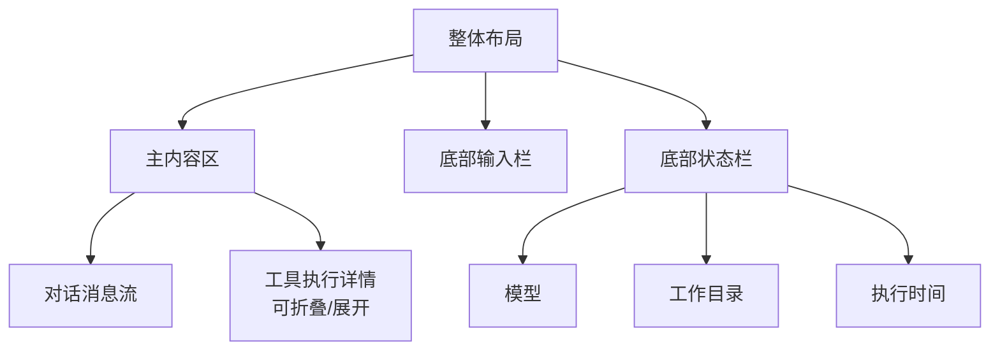

## 📋 项目决策总结：yet another Coding Agent

### 1. 核心定位与边界
| 决策点         | 最终决策                                 | 说明                                    |
| -------------- | ---------------------------------------- | --------------------------------------- |
| **项目核心**   | CLI 为主程序，客户端/Web 为附属          | CLI 即核心引擎                          |
| **多模态范围** | 图片 + 文本                              | 支持通过 `@path` 引用本地图片           |
| **Agent 架构** | 自研 Agent Loop                          | 基于从零实现的流式 XML 工具调用解析协议 |
| **目标平台**   | 跨平台（Node.js CLI + Tauri 客户端/Web） | CLI 优先，客户端可选                    |

---

### 2. 技术栈选型


---

### 3.3. 架构设计决策

## 3.1 整体架构分层


#### 3.2 双模式运行
| 模式            | 启动方式            | 输入来源        | 输出方式         | 适用场景             |
| --------------- | ------------------- | --------------- | ---------------- | -------------------- |
| **REPL 模式**   | `yaca`              | `process.stdin` | `process.stdout` | 开发者直接使用       |
| **Server 模式** | `yaca --serve 3000` | HTTP/WebSocket  | SSE/WebSocket    | Tauri/Web 客户端连接 |

> **关键设计**：两种模式共享同一套 Agent 执行内核，仅输入输出通道不同。

---

### 4. 多模态输入实现

#### 4.1 多模态模型运行

项目选定使用 Qwen3.6 作为首选多模态模型，通过 API 进行调用。

#### 4.2 `@path` 解析相关

* 支持绝对路径和相对路径
* 支持常见图片格式（.jpg, .png, .webp）
* 支持单个/多个 `@path` 引用
* 解析逻辑为：尝试解析为文件路径，成功则读取并转换为 Base64 消息，失败则保留原文本。


#### 4.3 Qwen3.6 消息适配
Qwen2.-VL 的多模态输入格式：

| 特性            | 格式                                                                          | 说明         |
| --------------- | ----------------------------------------------------------------------------- | ------------ |
| **Base64 图片** | `{"type": "image_url", "image_url": {"url": "data:image/jpeg;base64,4,..."}}` | 主要使用方式 |
| **URL 图片**    | `{"type": "image_url",image_url": {"url": "https://..."}}`                    | 可选支持     |
| **文本消息**    | `{"type": "text", "text": "..."}`                                             | 标准文本     |

---

### 5. 工具集规划（第一版）

 | 工具名           | 功能               | 关键参数                                                                               |
 | ---------------- | ------------------ | -------------------------------------------------------------------------------------- |
 | `get_tool_hint`  | 获取工具使用格式   | `toolName?`                                                                            |
 | `read_file`      | 读取文件内容       | `path`, `startLineNumber?`, `startColumn?`, `endLineNumber?`, `endColumn?`             |
 | `write_file`     | 创建或完全覆写文件 | `path`, `content`, `append?`, `encoding?`, `dangerouslyOverride?`                      |
 | `replace_file`   | 精准替换文件内容   | `path`, `new_text`, `startLineNumber?`, `startColumn?`, `endLineNumber?`, `endColumn?` |
 | `list_directory` | 列出目录结构       | `path`, `recursive?`                                                                   |
 | `search_files`   | 全文搜索           | `pattern`, `path?`, `include?`                                                         |
 | `exec_command`   | 执行 Shell 命令    | `command`, `timeout?`, `cwd?`                                                          |

> **核心设计**：工具通过注册表自描述，Agent 循环无硬编码逻辑。

---

### 6. UI/UX 设计决策

#### 6.1 整体布局结构

两列布局：



#### 6.2 Ink.js 与 React Web 共享策略
| 层次           | 职责                     | 示例                                         |
| -------------- | ------------------------ | -------------------------------------------- |
| **共享层**     | 布局、状态管理、业务逻辑 | `MainLayout`, `useAgentLoop`                 |
| **平台适配层** | 平台特定渲染             | `InkStatusBarPreview`, `WebStatusBarPreview` |

> **设计原则**：逻辑在共享层，渲染在平台层。

#### 6.3 关键交互流程

流式解析将使用 [@woisol-g/sxml.js](https://github.com/Woisol/sxml.js) 库实现。对于以下解析结果：
1. **文本消息**：直接流式渲染到对话流中。
2. **think 块**：流式渲染。
3. **工具调用**：当解析到 tool_call 事件时，创建一个工具调用卡片，显示工具名称和参数，并在解析完成后执行工具并显示结果。
<!-- 1. **工具调用流式渲染**：
   - 文本 token → 直接渲染
   - 开始标签 → 创建工具调用块
   - 参数 token → 流式显示
   - 结束标签 → 执行并显示结果

1. **状态指示**：
   - `● 思考中...` (LLM 调用)
   - `⚡ 执行: tool_name` (工具执行)
   - `✓ 完成: 3个文件已修改` (结果) -->

---

### 7. 快捷键设计

| 快捷键      | 功能              | 说明                                            |
| ----------- | ----------------- | ----------------------------------------------- |
| Enter       | 发送消息          | 提交当前输入框中的所有内容                      |
| Ctrl+C      | 复制/中断当前操作 | 如果Agent正在生成，则停止生成。否则复制选中内容 |
| 双击 Ctrl+C | 退出程序          | 在输入提示符处快速按两次，安全退出程序          |
| Esc         | 取消当前输入      | 清空输入框，不发送                              |
| Ctrl+V      | 粘贴文本/图片     | 将剪贴板中的图片作为@path引用插入               |

### 8. 内置命令设计

| 命令           | 功能         | 说明                                          |
| -------------- | ------------ | --------------------------------------------- |
| /model <name>  | 切换模型     | 支持切换到不同的LLM（如Qwen3.6、Claude等） |
| /baseurl <url> | 设置Base URL | 配置API请求的基础URL，支持本地代理或远程服务  |
| /clear         | 清除上下文   | 清空当前对话历史和上下文信息                  |
| /resume        | 恢复历史对话 | 浏览并恢复之前的历史对话                      |
| /help          | 显示帮助信息 | 列出所有内置命令和使用说明                    |

同样设计一套命令注册系统，将命令处理函数与说明文档放到一起。

### 9. 对话数据持久化设计

<!--  使用 PostgreSQL 数据库存储对话数据，设计如下表结构：

```sql
-- 会话表
CREATE TABLE sessions (
    id UUID PRIMARY KEY DEFAULT gen_random_uuid(),
    project_path TEXT NOT NULL,
    title TEXT,
    delete_at datetime NULL DEFAULT NULL,
    created_at datetime NOT NULL DEFAULT CURRENT_TIMESTAMP,
    updated_at datetime NOT NULL ON UPDATE CURRENT_TIMESTAMP,
    events json NOT NULL DEFAULT '[]'::json
);

-- 回溯表（暂定）
CREATE TABLE retrospectives (
    id UUID PRIMARY KEY DEFAULT gen_random_uuid(),
    session_id UUID NOT NULL,
    modified_files json NOT NULL,
``` -->

#### 📁 存储结构设计

参考 Claude Code 的 `~/.claude` 模式，我们设计以下结构：

```
~/.yaca/               # 全局根目录
├── config.json                # 全局配置 (模型、baseURL等)
├── sessions/                  # 所有会话的索引
│   └── <project-hash>/        # 按项目路径哈希分目录
│       ├── meta.json          # 该项目的会话列表
│       └── <session-id>/      # 每个会话一个目录
│           ├── session.json   # 会话元数据
│           ├── messages.jsonl # 对话历史 (JSONL格式)
│           └── context.json   # 压缩后的上下文快照（？）
└── cache/                     # 临时缓存
    └── <hash>/                # 按内容哈希分目录
        └── file.ext           # 缓存的图片/base64数据
```

#### 📊 具体文件格式参考

##### 1. `session.json` (会话元数据)
```json
{
  "id": "someuuid",
  "name": "实现用户登录功能",
  "project_path": "/home/user/my-project",
  "created_at": "2026-05-05T10:30:00Z",
  "updated_at": "2026-05-05T11:45:00Z",
  "message_count": 15,
  "total_tokens": 12500
}
```

##### 2. `messages.jsonl` (对话历史)

##### 3. `config.json` (全局配置)
```json
{
  "default_model": "qwen3.6",
  "models": [
    {"name": "qwen3.6", "base_url": "https://api.qwen.ai/v1"},
    {"name": "claude-3-5-sonnet", "base_url": "https://api.anthropic.com"}
  ],
  // 可能后续支持
  // "ui": {
  //   "default_theme": "dark",
  //   "compact_mode": false
  // }
}
```

#### ⚡ 关键实现策略

##### 1. 会话管理流程

使用 `yaca` 首次进入时提示创建/恢复会话。直接发送信息为创建新会话，使用 `/resume` 命令进入会话浏览器选择历史会话。每次对话结束后自动保存消息到对应的 `messages.jsonl` 文件中，并更新 `session.json` 的元数据。

##### 2. 上下文压缩策略
随着对话增长，需要智能压缩以适配模型的上下文窗口。

##### 3. 文件锁与并发安全
对于会话文件的读写，使用文件锁机制确保原子性，避免并发访问导致的数据损坏。

<!--#### 🛠️ 实用工具函数设计

##### 1. 会话浏览器命令
```bash
# 列出所有会话
$ yaca /sessions

# 按项目过滤
$ yaca /sessions --project /home/user/my-project

# 恢复指定会话
$ yaca --resume session_20260505_abc123

# 删除旧会话
$ yaca /sessions --clean --older-than 30d
```

##### 2. 数据导出/导入
```bash
# 导出会话为可读格式
$ yaca /export session_id --format markdown > login-feature.md

# 导出为 JSON
$ yaca /export session_id --format json > session.json

# 导入历史会话
$ yaca /import other-session.jsonl --project /new/project
``` -->

#### 📈 性能优化考虑

| 场景           | 优化策略                                            |
| -------------- | --------------------------------------------------- |
| **启动加载**   | 只加载最近的 N 条消息，其余懒加载                   |
| **搜索历史**   | 维护一个内存索引，避免全文扫描 JSONL                |
| **大图片缓存** | `@path` 图片转 base64 后存入 `cache/`，避免重复读取 |
| **并发写入**   | 使用文件锁确保原子性                                |

### 10. 交付产物

打包为 npm 软件包，用户可通过 `npm install -g yaca` 安装并使用。

### 11. 待讨论/后续迭代
1. **上下文管理策略**（长对话、大型项目）
2. **权限与安全机制**（工具执行确认）
3. **主题系统**（明暗主题切换）
4. **性能优化**（图片压缩、大文件处理）

--

### 12. 参考资源
- **Qwen3.6 文档**：阿里云多模态模型指南
- **Ink.js 最佳实践**：*：React for CLI
- **Claude Code UI 参考**：端界面设计模式
- **多模态输入实现**：：vLLM 多模态处理
