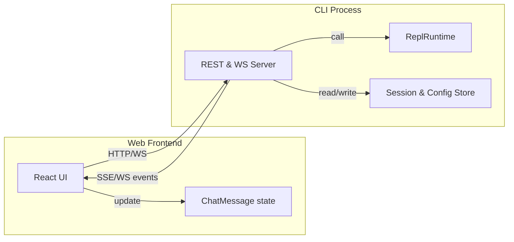

YACA Web 接口设计（05-10）

web 端只作为 CLI 的外部界面，负责渲染与交互，主要逻辑仍由 CLI 端执行。web 通过 HTTP/WS 转发请求，并复用 CLI 现有的类型与纯函数。

1. 总体思路

- web 不跑 agent loop / 不直接访问 SessionStore / ConfigStore
- web 只负责：
  - 渲染 ChatMessage[]（复用 CLI 的 ChatMessage 类型）
  - 把用户操作转成 HTTP/WS 请求
  - 接收 SSE/WS 推送的 AgentEvent，调用同样的 appendAssistantEvent / applyToolCall / applyToolResult 更新前端状态
- CLI 端新增一个轻量 HTTP/WS 服务模块，把现有 ReplRuntime / runAgentTurn 包一层，暴露成：
  - REST：会话管理、配置、工具列表等
  - WS：对话流、事件推送、中断等

2. 核心数据结构（尽量复用）

2.1 UI 消息：ChatMessage

// apps/cli/src/screens/home/chat/ChatArea.tsx 中已有
```ts
export type ChatMessage = {
  kind: 'user' | 'assistant' | 'tool' | 'status' | 'error';
  text?: string;
  callId?: string;
  toolName?: string;
  args?: Record<string, unknown>;
  status?: 'running' | 'success' | 'error';
  result?: string;
  expanded?: boolean;
  rawResponse?: string;
};
```

web 端直接复用这个类型，渲染逻辑用 React 重写，但数据结构保持一致。

2.2 Agent 事件：AgentEvent

// packages/shared/types/index.ts 中已有
```ts
export type AgentEvent =
  | { type: 'assistant_delta'; text: string }
  | { type: 'assistant_replace'; text: string }
  | { type: 'assistant_text'; text: string }
  | { type: 'assistant_event'; patch: AssistantEventPatch }
  | { type: 'tool_call'; call: ToolCall; rawResponse: string }
  | { type: 'tool_result'; call_id?: string; result: ToolResult; rawResponse: string }
  | { type: 'error'; message: string };
  ```

WS/SSE 事件体直接用这个类型，前端收到后调用 CLI 同款纯函数更新 ChatMessage[]。

3. 接口协议设计

3.1 总览



- REST：负责「查询 / 管理」类操作（会话列表、配置、工具列表等）
- WS：负责「对话 / 流式事件」（runAgentTurn、中断、rewind、resume 等）

3.2 REST 接口

基础路径：/api（端口在 CLI 启动时指定或默认）

3.2.1 会话相关

1. GET /api/sessions

   - 功能：返回当前项目的会话列表（等价于 runtime.store.listSessions()）
   - 响应体：

     type SessionMeta = {
       id: string;
       name: string;
       project_path: string;
       created_at: string;
       updated_at: string;
       message_count: number;
       total_tokens: number;
     };

     type ListSessionsResponse = {
       sessions: SessionMeta[];
     };

2. POST /api/sessions

   - 功能：创建新会话（等价于 runtime.store.createSession(name)）
   - 请求体：

     type CreateSessionRequest = {
       name?: string; // 默认 'New session'
     };

   - 响应体：

     type CreateSessionResponse = {
       session: SessionMeta;
     };

3. GET /api/sessions/:sessionId

   - 功能：获取单个会话元信息（runtime.store.getSession(id)）
   - 响应体：

     type GetSessionResponse = {
       session: SessionMeta | null;
     };

4. GET /api/sessions/:sessionId/messages

   - 功能：获取某个会话的历史消息（runtime.store.readMessages(id)）
   - 响应体：

     type GetMessagesResponse = {
       messages: ChatMessage[]; // 使用 CLI 已有的 renderSessionMessages 转换后的 UI 消息
     };

   - CLI 实现建议：
     - 从 store.readMessages(id) 拿到 StoredChatMessage[]
     - 用 renderSessionMessages 转成 UI 用的 ChatMessage[] 再返回

5. POST /api/sessions/:sessionId/rewind

   - 功能：回滚到某条用户消息（等价于 applyRewindSelection）
   - 请求体：

     type RewindRequest = {
       selectedIndex: number; // 前端选中的 message index
     };

   - 响应体：

     type RewindResponse = {
       messages: ChatMessage[];           // 回滚后的 messages
       input: string;                     // 建议填充的输入
       storedMessages: StoredChatMessage[]; // 更新后的存储
     };

   - CLI 实现：
     - 从前端拿到 selectedIndex
     - 调用 applyRewindSelection(messages, selectedIndex)
     - 同时 store.replaceMessages(sessionId, result.storedMessages)
     - 返回 result 给前端

3.2.2 配置相关

1. GET /api/config

   - 功能：获取当前配置（runtime.state.config）
   - 响应体：

     type GetConfigResponse = {
       config: YacaConfig;
     };

2. PATCH /api/config

   - 功能：部分更新配置（如 trustMode、allow tools 等）
   - 请求体：

     type UpdateConfigRequest = {
       trustMode?: boolean;
       allowTools?: string[];
       // 其他需要的可写字段
     };

   - CLI 实现：
     - 合并到 runtime.state.config
     - 调用 runtime.state.configStore.save(config) 持久化
   - 响应体：

     type UpdateConfigResponse = {
       config: YacaConfig;
     };

3.2.3 工具与权限

1. GET /api/tools

   - 功能：获取可用工具列表（runtime.tools.definitions()）
   - 响应体：

     type ToolDefinition = {
       name: string;
       description: string;
       parameters: Record<string, string>;
     };

     type ListToolsResponse = {
       tools: ToolDefinition[];
       allowTools: string[]; // 当前允许的工具
     };

2. POST /api/tools/allow

   - 功能：更新允许的工具列表（等价于 toggleAllowedTool）
   - 请求体：

     type UpdateAllowToolsRequest = {
       allowTools: string[];
     };

   - 响应体同上 ListToolsResponse，同时更新 runtime.state.config.tool_call.allow.tools。

3.3 WebSocket 接口

路径：/api/ws，连接时可以带上 ?sessionId=xxx，方便 CLI 绑定当前会话。

3.3.1 客户端 -> 服务器消息类型（C2S）

1. chat.send

   - 用户发送一条消息
   - 请求：

     type ChatSendRequest = {
       type: 'chat.send';
       id: string;          // 前端生成的请求 ID，用于响应对应
       sessionId: string;
       text: string;
       // 可选：如果前端已经解析过，可以传 content
       userContent?: StoredChatMessage['content'];
     };

   - CLI 收到后：
     - 设置 runtime.state.sessionId = sessionId
     - 调用 runAgentTurn，并传入：
       - appendLine：通过 WS 推 chat.line 事件
       - setMessages：通过 WS 推 chat.messages 事件
       - showToolOutput：从配置中读

2. chat.abort

   - 中断当前对话
   - 请求：

     type ChatAbortRequest = {
       type: 'chat.abort';
       id: string;
       sessionId: string;
     };

   - CLI 实现：activeTurnControllerRef.current?.abort()

3. session.resume

   - 恢复某个历史会话
   - 请求：

     type SessionResumeRequest = {
       type: 'session.resume';
       id: string;
       sessionId: string;
     };

   - CLI 实现：
     - runtime.store.resumeSession(sessionId)
     - runtime.state.sessionId = sessionId
     - 读取历史消息并用 renderSessionMessages 转成 ChatMessage[]
     - 推送 chat.messages 事件给前端

4. tool.confirm

   - 前端确认/拒绝工具调用
   - 请求：

     type ToolConfirmRequest = {
       type: 'tool.confirm';
       id: string;
       callId: string;
       approved: boolean;
     };

   - CLI 实现：
     - 找到对应的 pendingToolApproval
     - 调用 resolve(approved)

3.3.2 服务器 -> 客户端消息类型（S2C）

1. chat.messages

   - 全量更新 ChatMessage[]
   - 响应：

     type ChatMessagesEvent = {
       type: 'chat.messages';
       id: string;     // 对应请求 ID
       messages: ChatMessage[];
     };

   - 前端收到后直接 setMessages(event.messages)。

2. chat.line

   - 追加一条简单消息（status / error 等）
   - 响应：

     type ChatLineEvent = {
       type: 'chat.line';
       id: string;
       kind: ChatMessage['kind']; // 'status' | 'error' | ...
       text: string;
     };

   - 前端收到后调用 appendChatLine(messages, kind, text)。

3. agent.event

   - 流式推送一个 AgentEvent
   - 响应：

     type AgentEventMessage = {
       type: 'agent.event';
       id: string;
       event: AgentEvent; // 使用 @yaca/types 里的定义
     };

   - 前端收到后，调用：
     - appendAssistantEvent
     - applyAssistantEventPatch
     - applyToolCall
     - applyToolResult
   - 这些函数可以从 @yaca/cli/api 里 re-export，或者单独抽一个 @yaca/web-api 包。

4. tool.confirm_request

   - 请求前端确认工具调用
   - 响应：

     type ToolConfirmRequestEvent = {
       type: 'tool.confirm_request';
       id: string;
       call: ToolCall;
       kind: 'tool' | 'command';
     };

   - 前端展示确认对话框，用户操作后发 tool.confirm。

5. session.list

   - 推送会话列表（比如创建/删除会话后）
   - 响应：

     type SessionListEvent = {
       type: 'session.list';
       id: string;
       sessions: SessionMeta[];
     };

3.4 错误格式

统一错误格式，方便前端处理：

type ApiError = {
  code: string;      // 如 'SESSION_NOT_FOUND', 'CONFIG_INVALID'
  message: string;
  details?: unknown;
};

// REST 响应
type ApiErrorResponse = {
  error: ApiError;
};

// WS 事件
type WSErrorEvent = {
  type: 'error';
  id: string;
  error: ApiError;
};

4. web 端大致结构建议

在 apps/yaca-web 里可以这样组织：

// src/api/types.ts
export type {
  ChatMessage,
  AgentEvent,
  SessionMeta,
  YacaConfig,
  ToolDefinition,
  ApiError,
  // ...
} from '@yaca/types'; // 或从统一的地方导出

// src/api/ws-client.ts
export function createWsClient() {
  // 连接 /api/ws
  // 发送 C2S 消息
  // 监听 S2C 事件，转换成回调
}

// src/api/rest-client.ts
export const rest = {
  listSessions() { /* fetch /api/sessions */ },
  createSession(req) { /* ... */ },
  getConfig() { /* ... */ },
  // ...
};

// src/hooks/useChat.ts
export function useChat() {
  const [messages, setMessages] = useState<ChatMessage[]>([]);
  const ws = useWsClient();

  // 收到 agent.event 时
  const handleAgentEvent = useCallback((event: AgentEvent) => {
    setMessages(prev => {
      // 复用 CLI 的纯函数
      if (event.type === 'assistant_delta') return appendAssistantDelta(prev, event.text);
      if (event.type === 'assistant_event') return applyAssistantEventPatch(prev, event.patch);
      if (event.type === 'tool_call') return applyToolCall(prev, event);
      if (event.type === 'tool_result') return applyToolResult(prev, event, showToolOutput);
      // ...
      return prev;
    });
  }, [showToolOutput]);

  // 绑定 WS 事件
  useEffect(() => {
    ws.on('agent.event', handleAgentEvent);
    ws.on('chat.messages', (e) => setMessages(e.messages));
    ws.on('chat.line', (e) => setMessages(prev => appendChatLine(prev, e.kind, e.text)));
    // ...
  }, [ws, handleAgentEvent]);

  const send = useCallback((text: string) => {
    ws.send({ type: 'chat.send', id: uuid(), sessionId, text });
  }, [ws, sessionId]);

  return { messages, send, abort, ... };
}

5. CLI 端需要新增的模块

在 CLI 里新增 apps/cli/src/server/ 目录：

- server/rest.ts：用 Express / Fastify 实现 REST
- server/ws.ts：用 ws / uWebSockets 实现 WS
- server/agent-bridge.ts：把 ReplRuntime + runAgentTurn 包一层，对接到 WS 事件

核心逻辑：

- REST 调 runtime.store.* / runtime.state.configStore.*
- WS 的 chat.send 调 runAgentTurn，并通过 WS 推送 chat.messages / agent.event / tool.confirm_request

6. 小结

- 数据结构：复用 ChatMessage、AgentEvent、SessionMeta、YacaConfig 等。
- REST：负责会话 / 配置 / 工具列表等查询与管理。
- WS：负责对话流、事件推送、工具确认、中断等交互式操作。
- 前端：用同样的纯函数更新 ChatMessage[]，保证渲染逻辑和 CLI 一致。